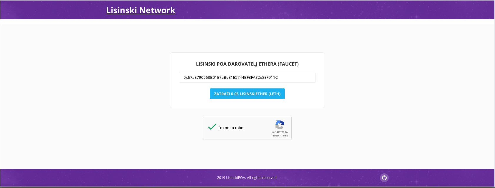
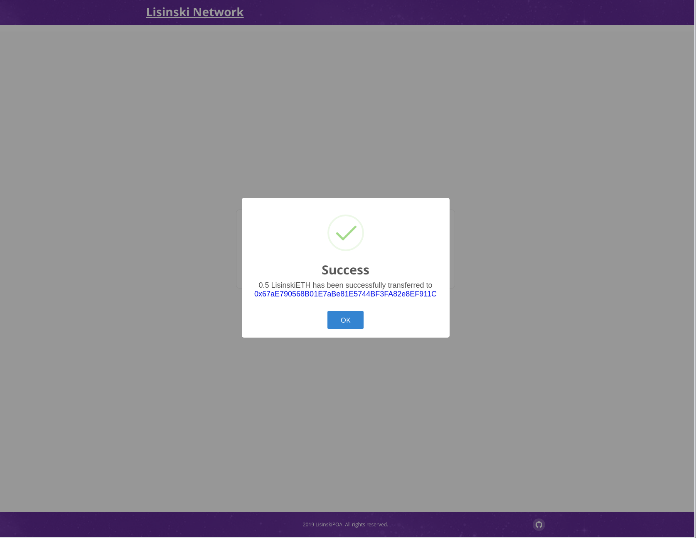
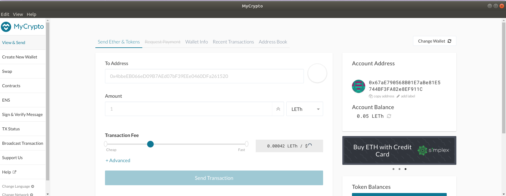

# How to obtain LEth (Lisinski Ethereum)

For requesting LEth go to:
https://pipa.lisinski.online/

Once there copy your wallet address and click on "I'm not a robot".

Once you succeed you will see the below image.

Your [wallet](https://bitfalls.com/2017/08/31/what-cryptocurrency-wallet/) balance should now be updated.

